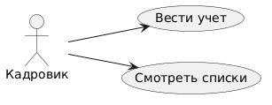

# StaffTrack
**Система учёта сотрудников и должностей.**

## Цели
- Хранение данных.
- Контроль штата.

## Роли
| Роль | Действие |
|------|----------|
| Кадровик | Учёт |

## Запуск
python src/main.py

## Автор
Ева Сорокина
## Диаграмма

